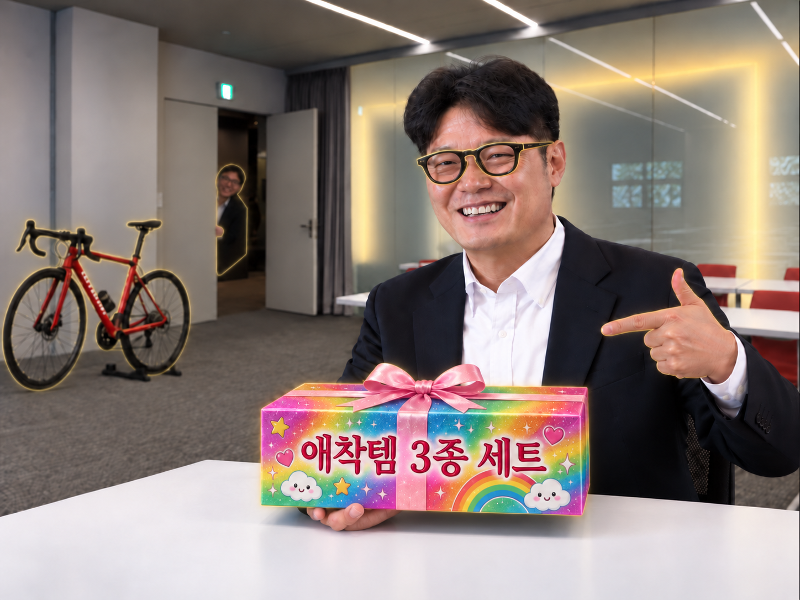
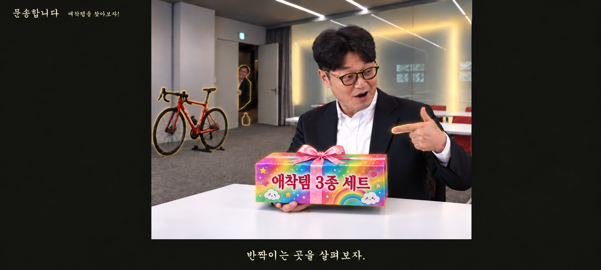

# 문송합니다 랜딩페이지 코드

> 이 문서는 현재 인터랙티브 랜딩페이지의 실행 소스를 GitHub에서 한 파일로 확인할 수 있도록 모은 스냅샷입니다.
> 실제 실행은 아래 파일들이 각각 분리된 상태로 동작합니다.

- 생성일: 2026-09-11
- 기술: HTML, CSS, Vanilla JavaScript
- 실행 파일: `index.html`
- 이미지 폴더: `assets/`

## 파일 구성

| 파일 | 역할 |
| --- | --- |
| `index.html` | 메인 장면, 인트로, 이벤트 대화창 |
| `style.css` | 레이아웃, B급 UI, 줌·블러, 빛가루, 공개 애니메이션 |
| `data.js` | 아이템 좌표, 진행 단계, 대사, 이미지 경로, 팀원 연결 |
| `state.js` | 발견 상태, 중단·재방문, 술병·손가락 해금 |
| `effects.js` | 대사 타이핑, 즉시 완성, 타이머 취소 |
| `audio.js` | 사용자 입장 후 재생하는 합성 효과음 |
| `highlights.js` | 아이템 강조용 SVG |
| `script.js` | Hotspot 생성, 입력, 장면 전환, 이미지 렌더링 |

## 실행 흐름

`인트로 → 자유 탐색 → Hotspot 클릭 → 줌·블러 → 대사 타이핑 → 실루엣 → 공개 → 탐색 복귀`

- 학장님을 끝까지 조사하면 술병 Hotspot이 나타납니다.
- 안경·자전거·상자·술병을 자유 순서로 끝까지 발견하면 새 장면으로 바뀌고 위로 세운 엄지가 활성화됩니다.
- 대사 출력 중 첫 클릭은 문장을 완성하고, 다음 클릭부터 다음 단계로 이동합니다.
- 중간에 닫으면 발견 처리되지 않으며, 완료한 아이템을 다시 열면 공개·설명 단계부터 시작합니다.

## 소스 코드

### index.html

```html
<!doctype html>
<html lang="ko">
<head>
  <meta charset="utf-8">
  <meta name="viewport" content="width=device-width, initial-scale=1">
  <meta name="theme-color" content="#151612">
  <meta name="description" content="교수님의 애착템을 찾아보는 문송합니다의 인터랙티브 팀 소개.">
  <title>문송합니다 — 교수님의 애착템</title>
  <link rel="stylesheet" href="style.css">
</head>
<body>
  <main id="game" aria-label="문송합니다 애착템 탐색">
    <div class="scene-frame">
      <div id="scene" class="scene">
        <div class="scene-art">
          
          
        </div>
        <div id="hotspots"></div>
      </div>
    </div>
    <div class="identity" aria-hidden="true">문송합니다 <span>애착템을 찾아보자!</span></div>
    <p id="hint" class="hint">반짝이는 곳을 살펴보자.</p>
    <p id="announcement" class="sr-only" role="status" aria-live="polite"></p>
    <section id="intro" class="intro" role="dialog" aria-modal="true" aria-labelledby="intro-title">
      <div class="intro-stamp" aria-hidden="true">★ 문송합니다 PRESENTS ★</div>
      <h1 id="intro-title"><span>남교수님의</span><span>애착아이템을</span><span>소개합니다.</span></h1>
      <button id="start" class="start" type="button">▶ 눌러서 입장 ◀</button>
    </section>
    <section id="event" class="event" role="dialog" aria-modal="true" aria-labelledby="speaker" hidden>
      <div class="shade"></div>
      <button id="close" class="close" type="button" aria-label="탐색으로 돌아가기">닫기 <span>ESC</span></button>
      <div id="visual" class="visual" aria-hidden="true"></div>
      <div class="dialogue-wrap">
        <div id="speaker" class="speaker">살펴보기</div>
        <button id="dialogue" class="dialogue" type="button" aria-describedby="controls">
          <span id="line" aria-hidden="true"></span>
          <span id="next-label" class="next-label">다음 <span class="arrow">▼</span></span>
        </button>
        <p id="controls" class="controls">클릭 · Enter · Space: 문장 완성 / 다음 <span>Esc 돌아가기</span></p>
      </div>
    </section>
  </main>
  <script src="data.js"></script>
  <script src="state.js"></script>
  <script src="effects.js"></script>
  <script src="audio.js"></script>
  <script src="highlights.js"></script>
  <script src="script.js"></script>
</body>
</html>
```

### style.css

```css
:root { color-scheme: dark; --paper: #fff8b5; --ink: #191040; --acid: #edff00; }
* { box-sizing: border-box; }
body { margin: 0; background: #151612; color: var(--paper); font-family: 'Gungsuh', '궁서', 'Batang', '바탕', serif; }
button { font: inherit; cursor: pointer; }
button:focus-visible { outline: 3px dashed #e6ff99; outline-offset: 5px; }
[hidden] { display: none !important; }
#game { --caption-height: 76px; position: relative; width: 100%; height: 100svh; min-height: 400px; overflow: hidden; isolation: isolate; }
.scene-frame { position: absolute; inset: 0 0 var(--caption-height); display: grid; place-items: center; overflow: hidden; }
.scene { position: relative; width: min(100vw, calc((100svh - var(--caption-height)) * 4 / 3)); aspect-ratio: 4/3; flex-shrink: 0; transition: transform .65s cubic-bezier(.22,.7,.2,1), filter .65s; }
.main-image { display: block; width: 100%; height: auto; user-select: none; }
.scene-art { position: absolute; inset: 0; overflow: hidden; pointer-events: none; }
/* 제공된 1867×842 화면에서 중앙 사진(470,0 / 995×746)만 표시합니다. */
.final-scene-image { position: absolute; top: 0; left: -47.236181%; width: 187.638191%; max-width: none; height: auto; opacity: 0; user-select: none; }
.scene.finger-unlocked .final-scene-image { opacity: 1; }
.scene.finger-unlocked .main-image { visibility: hidden; }
/* 마지막 사진에는 술병 테두리도 포함되어 있어 중복 발광을 막습니다. */
.scene.finger-unlocked .hotspot[data-item="bottle"] .hotspot-glow { display: none; }
.identity { position: absolute; top: 20px; left: 24px; padding: 7px 10px; background: #151612b5; font-size: 16px; letter-spacing: .08em; pointer-events: none; }
.identity span { margin-left: 12px; opacity: .6; font-size: 12px; letter-spacing: 0; }
.hint { position: absolute; bottom: 0; left: 0; width: 100%; min-height: var(--caption-height); margin: 0; padding: 12px 20px; display: grid; place-items: center; color: #fffde7; background: #151612; font-size: 27px; line-height: 1.35; text-align: center; pointer-events: none; }
.hotspot { position: absolute; transform: translate(-50%, -50%); border: 0; background: transparent; padding: 0; touch-action: manipulation; }
.hotspot::after { content: ''; position: absolute; left: 50%; top: 50%; transform: translate(-50%,-50%); width: 100%; height: 100%; min-width: 36px; min-height: 36px; }
.hotspot-glow { position: absolute; inset: 0; width: 100%; height: 100%; overflow: visible; pointer-events: none; fill: none; stroke: #fff36b; stroke-width: 2; stroke-linecap: round; stroke-linejoin: round; filter: drop-shadow(0 0 4px #ffe900) drop-shadow(0 0 12px #ffdf5dcc); opacity: .88; }
.hotspot-glow path { vector-effect: non-scaling-stroke; }
.hotspot:hover .hotspot-glow, .hotspot:focus-visible .hotspot-glow { opacity: 1; stroke-width: 2.8; }
.hotspot.final .hotspot-glow { stroke-width: 3; filter: drop-shadow(0 0 6px #fff000) drop-shadow(0 0 18px #ffe66b); }
.hotspot[data-item="bottle"] .hotspot-glow { stroke: #ffe39a; stroke-width: 1.25; opacity: .75; filter: drop-shadow(0 0 2px #ffe39a99) drop-shadow(0 0 5px #ffda7766); }
.hotspot[data-item="bottle"]:hover .hotspot-glow, .hotspot[data-item="bottle"]:focus-visible .hotspot-glow { stroke-width: 1.5; opacity: .9; }
.fairy-dust { position: absolute; inset: 0; display: block; pointer-events: none; overflow: visible; opacity: .8; transition: opacity .25s; }
.dust-grain { position: absolute; display: block; left: var(--x); top: var(--y); width: var(--size); height: var(--size); border-radius: 50%; background: #fff9d2; box-shadow: 0 0 4px 1px #ffe9a9a0, 0 0 10px 2px #ffe48b35; opacity: .65; animation: dust-drift var(--duration) var(--delay) infinite ease-in-out; }
.dust-grain:nth-child(5n) { background: #fff; box-shadow: 0 0 5px 2px #fff6cca0, 0 0 13px 3px #ffeaa340; }
.fairy-dust .dust-grain { width: calc(var(--size) * 1.5); height: calc(var(--size) * 1.5); box-shadow: 0 0 5px 2px #fff193b0, 0 0 12px 3px #ffe76b60; }
.hotspot:hover .fairy-dust, .hotspot:focus-visible .fairy-dust { opacity: 1; }
.hotspot.discovered .dust-grain { background: #f0ffdb; box-shadow: 0 0 4px 1px #e6ffbca0, 0 0 10px 2px #daff9635; }
.hotspot.final .fairy-dust { opacity: 1; }
.hotspot.final .dust-grain { width: calc(var(--size) * 1.25); height: calc(var(--size) * 1.25); box-shadow: 0 0 6px 2px #fff3aab0, 0 0 15px 3px #ffef9a50; }
@keyframes dust-drift {
  0% { opacity: 0; transform: translate(0, 7px) scale(.4); }
  22% { opacity: .75; }
  48% { opacity: .35; }
  65% { opacity: .95; }
  100% { opacity: 0; transform: translate(var(--dx), calc(-1 * var(--rise))) scale(.3); }
}
#game.in-event .scene { filter: blur(6px) brightness(.55); }
#game.in-event .identity, #game.in-event > .hint { opacity: 0; }
.event { position: absolute; inset: 0; z-index: 3; }
.shade { position: absolute; inset: 0; background: #10120d50; }
.close { position: absolute; z-index: 3; right: 24px; top: 20px; color: var(--paper); padding: 9px 12px; background: #24281dde; border: 1px solid #e0dfbb88; font-size: 14px; }
.close span { opacity: .55; padding-left: 8px; font-size: 12px; }
.visual { position: absolute; top: 8%; bottom: 35%; left: 15%; right: 15%; display: flex; justify-content: center; align-items: center; min-width: 0; min-height: 0; }
.visual { --item-glow: drop-shadow(1px 0 0 #fff48c) drop-shadow(-1px 0 0 #fff48c) drop-shadow(0 1px 0 #fff48c) drop-shadow(0 -1px 0 #fff48c) drop-shadow(0 0 8px #ffe976a0) drop-shadow(0 0 22px #fff48c80); }
.visual:not(:empty)::after { content: ''; position: absolute; inset: -4%; z-index: -1; pointer-events: none; background: radial-gradient(ellipse, #fff17620 0%, #fff48c12 35%, transparent 70%); }
.visual img.asset { display: block; width: 100%; height: 100%; min-height: 0; object-fit: contain; filter: var(--item-glow); animation: arrive .4s ease-out; }
.visual img.silhouette { filter: brightness(0) var(--item-glow); }
.placeholder { text-align: center; text-shadow: 3px 3px #000; }
.placeholder .unknown { display: block; font: 900 clamp(64px, 13svh, 150px)/1 'Courier New', monospace; color: #131610; text-shadow: -1px -1px 0 #fff48c, 1px 1px 0 #fff48c, 0 0 12px #ffe976a0, 0 0 30px #fff48c80; }
.placeholder small { display: block; font-size: 14px; line-height: 1.7; color: #e9eccf; margin-top: 20px; }
.placeholder .pending-name { font-size: clamp(24px, 4vw, 46px); color: #fff48c; text-shadow: 0 0 8px #ffe976a0, 0 0 22px #fff48c80; }
.crop { width: min(56vw, 620px, calc(43svh * var(--crop-ratio))); flex-shrink: 0; overflow: hidden; position: relative; box-shadow: 10px 12px 0 #0004; animation: arrive .35s ease-out; }
.crop img { display: block; position: absolute; max-width: none; }
.box-opening { perspective: 1000px; }
.box-opening .crop { transform-origin: bottom; animation: box-open .75s both; }
.empty-label { background: #141510; padding: 30px 48px; border: 3px double #847953; font-size: clamp(24px, 4vw, 48px); transform: rotate(-4deg); box-shadow: 8px 8px #0005; animation: arrive .35s ease-out; }
.visual .crop, .visual .empty-label { box-shadow: 0 0 0 1px #fff48c, 0 0 10px #ffe976a0, 0 0 28px #fff48c80; }
.dialogue-wrap { position: absolute; left: max(24px, calc((100vw - 1050px)/2)); right: max(24px, calc((100vw - 1050px)/2)); bottom: 25px; }
.speaker { display: table; position: relative; margin-left: 9px; padding: 8px 23px; background: linear-gradient(90deg, #130078, #8334b4); color: #ffff00; border: 3px outset #cacaca; border-bottom: 0; font-weight: 700; font-size: 18px; text-shadow: 2px 2px #000; transform: rotate(-2deg); }
.dialogue { position: relative; display: block; text-align: left; width: 100%; min-height: 148px; padding: 27px 32px 50px; border: 7px ridge #d9d9d9; outline: 2px solid #17113f; background: repeating-linear-gradient(0deg, #fff8b5 0 3px, #fff5a5 3px 4px); color: var(--ink); box-shadow: 9px 10px 0 #0009; font-size: clamp(19px, 1.9vw, 26px); font-weight: 700; line-height: 1.55; touch-action: manipulation; }
.dialogue:focus-visible { outline: 3px dashed var(--acid); outline-offset: 6px; }
.next-label { position: absolute; right: 22px; bottom: 13px; font-weight: 400; font-size: 14px; }
.arrow { display: inline-block; padding-left: 8px; animation: nod .9s steps(2) infinite; }
.controls { display: flex; justify-content: space-between; margin: 12px 0 0; color: #eee8cf; font-size: 12px; text-shadow: 1px 1px #000; }
.event.zooming .visual, .event.zooming .dialogue-wrap { opacity: 0; pointer-events: none; }
.event.final-event .visual::before { content: ''; position: absolute; inset: 0; background: radial-gradient(ellipse, #eeff8b33, transparent 65%); z-index: -1; }
.sr-only { position: absolute; width: 1px; height: 1px; padding: 0; margin: -1px; overflow: hidden; clip: rect(0,0,0,0); white-space: nowrap; border: 0; }
.intro { position: absolute; z-index: 10; inset: 0; display: flex; align-items: center; justify-content: center; flex-direction: column; gap: clamp(15px, 3svh, 32px); padding: 24px; background: radial-gradient(ellipse at center, #160057b5, #090014ed); text-align: center; overflow-y: auto; }
.intro-stamp { color: #00ffff; letter-spacing: .25em; font-family: 'Gulim', '굴림', sans-serif; font-size: clamp(13px, 1.5vw, 18px); font-weight: 900; text-shadow: 2px 2px #ff00c8; }
.intro h1 { margin: 0 0 12px; font-family: 'Gungsuh', '궁서', 'Batang', '바탕', serif; font-size: clamp(35px, min(7vw, 9svh), 104px); font-weight: 900; line-height: 1.3; letter-spacing: -.07em; transform: rotate(-5deg) skew(-6deg); }
.intro h1 span { display: block; color: #ffed00; text-shadow: 2px 2px 0 #ff0099, 4px 4px 0 #ff0099, 6px 6px 0 #6026ee, 8px 8px 0 #6026ee, 10px 10px 0 #000; -webkit-text-stroke: 1px #7c1900; }
.intro h1 span:nth-child(2) { color: #53ffed; -webkit-text-stroke-color: #003074; }
.intro h1 span:nth-child(3) { color: #ff9bf5; -webkit-text-stroke-color: #680070; }
.start { background: #c6c6c6; color: #10045a; border: 6px outset #eee; padding: 13px 28px; box-shadow: 6px 6px #000; font-family: 'Gulim', '굴림', sans-serif; font-size: clamp(17px, 2vw, 24px); font-weight: 900; }
.start:hover { color: #c000a0; background: #fffab3; }
.start:active { border-style: inset; translate: 2px 2px; }
@keyframes twinkle { 0%, 100% { opacity: .3; scale: .7; } 50% { opacity: .9; scale: 1; } }
@keyframes final-glow { 0%, 100% { scale: .9; opacity: .7; } 50% { scale: 1.5; opacity: 1; } }
@keyframes nod { 50% { transform: translateY(3px); } }
@keyframes arrive { from { opacity: 0; translate: 0 8px; } to { opacity: 1; translate: 0 0; } }
@keyframes box-open { to { transform: rotateX(62deg); opacity: .35; } }
/* 기존 위치/크기는 유지하고 이벤트용 이미지 레이어에만 효과를 추가합니다. */
.visual { isolation: isolate; }
.visual.silhouette-arrival > * { animation: silhouette-arrival .45s ease-out both; }
.visual.reveal-pop > * { animation: reveal-pop .4s ease-out both; }
.visual.reveal-pop.reveal-secret > * { animation: reveal-pop .4s ease-out both, reveal-jolt .22s ease-out; }
.visual.reveal-pop::before { content: ''; position: absolute; inset: -5%; z-index: -1; pointer-events: none; background: radial-gradient(ellipse, #fff4b065 0, #fff4b025 35%, transparent 67%); animation: reveal-light .45s ease-out both; }
.dialogue.typing .next-label { opacity: .7; }
@keyframes silhouette-arrival { from { opacity: 0; transform: scale(.85); } to { opacity: 1; transform: scale(1); } }
@keyframes reveal-pop { 0% { opacity: .3; transform: scale(.92); } 65% { opacity: 1; transform: scale(1.035); } 100% { opacity: 1; transform: scale(1); } }
@keyframes reveal-light { 0%, 100% { opacity: 0; } 35% { opacity: 1; } }
@keyframes reveal-jolt { 0% { translate: -3px 0; } 25% { translate: 3px 0; } 55% { translate: -2px 0; } 100% { translate: 0 0; } }
@media (max-width: 600px) {
  .identity { left: 12px; top: 12px; }
  .identity span { font-size: 12px; }
  .dialogue-wrap { left: 15px; right: 15px; bottom: 18px; }
  .dialogue { min-height: 160px; padding: 22px 18px 45px; }
  .visual { left: 8%; right: 8%; top: 12%; bottom: 40%; }
  .crop { width: min(78vw, calc(40svh * var(--crop-ratio))); }
  .close { top: 12px; right: 12px; }
  #game { --caption-height: 88px; }
  .hint { font-size: 24px; }
  .controls span { display: none; }
}
@media (max-height: 540px) and (min-width: 601px) {
  .dialogue-wrap { bottom: 12px; }
  .dialogue { min-height: 98px; padding: 14px 24px 36px; font-size: 17px; }
  .controls { display: none; }
  .visual { top: 9%; bottom: 42%; }
  .speaker { padding: 5px 15px; }
}
@media (prefers-reduced-motion: reduce) {
  *, *::before, *::after { animation-duration: .01ms !important; animation-iteration-count: 1 !important; transition-duration: .01ms !important; }
  .visual.silhouette-arrival > *, .visual.reveal-pop > * { animation: none !important; }
  .visual.reveal-pop::before { display: none; }
}
```

### data.js

```javascript
/* 대사를 추가하려면 steps에 { phase, visual, text }를 추가하세요.
 * phase: DIALOGUE | SILHOUETTE | REVEAL | ITEM_DESCRIPTION | TEAM_MEMBER
 * visual: none | silhouette | object | opening | empty | reveal
 * 이미지 경로가 null이면 명시적인 임시 표시를 사용합니다. 실제 사진을 생성하지 않습니다.
 * 각 이미지의 투명 배경 PNG/WebP 사용을 권장합니다.
 */
globalThis.GAME_DATA = {
  scene: { image: 'assets/main/main-image-v3.png', width: 1448, height: 1086, bakedHighlights: true },
  required: ['glasses', 'bicycle', 'box', 'bottle'],
  items: {
    box: {
      id: 'box', name: '상자', hotspot: { x: 53.2, y: 73.4, w: 41.5, h: 26 }, zoom: 1.55,
      member: null, silhouette: null, revealImage: null,
      crop: { x: 32.2, y: 59.8, w: 42, h: 26 },
      steps: [
        { phase: 'DIALOGUE', visual: 'object', text: '[상자를 열기 전 대사]' },
        { phase: 'REVEAL', visual: 'opening', text: '[상자를 여는 대사]' },
        { phase: 'REVEAL', visual: 'empty', text: '비어있음' },
        { phase: 'ITEM_DESCRIPTION', visual: 'empty', text: '[빈 상자 설명 대사]' }
      ],
      revisit: [
        { phase: 'REVEAL', visual: 'empty', text: '비어있음' },
        { phase: 'ITEM_DESCRIPTION', visual: 'empty', text: '[빈 상자 설명 대사]' }
      ]
    },
    bicycle: {
      id: 'bicycle', name: '자전거', hotspot: { x: 12, y: 50.8, w: 24, h: 29 }, zoom: 1.65,
      member: null, silhouette: 'assets/items/bicycle-cutout.png', revealImage: null,
      objectImage: 'assets/items/bicycle-cutout.png',
      crop: { x: 0, y: 36.2, w: 24, h: 29 },
      steps: [
        { phase: 'SILHOUETTE', visual: 'silhouette', text: '[자전거 실루엣 대사]' },
        { phase: 'DIALOGUE', visual: 'silhouette', text: '[자전거 정답 예상 대사]' },
        { phase: 'REVEAL', visual: 'object', text: '[정말 자전거인 것을 확인하는 대사]' },
        { phase: 'ITEM_DESCRIPTION', visual: 'object', text: '[자전거 설명 대사]' }
      ]
    },
    glasses: {
      id: 'glasses', name: '안경', hotspot: { x: 60.8, y: 27, w: 18, h: 8.5 }, zoom: 2.1,
      member: { name: '성다희', role: '디자인 / 개발' }, silhouette: null, revealImage: null,
      crop: { x: 51.5, y: 22.7, w: 18.5, h: 9 },
      steps: [
        { phase: 'SILHOUETTE', visual: 'silhouette', text: '[안경 실루엣 대사]' },
        { phase: 'DIALOGUE', visual: 'silhouette', text: '[안경 정답 예상 대사]' },
        { phase: 'REVEAL', visual: 'object', text: '[안경 공개 대사]' },
        { phase: 'DIALOGUE', visual: 'object', text: '[안경에 비친 무언가를 발견하는 대사]' },
        { phase: 'REVEAL', visual: 'reveal', text: '[안경에 비친 성다희 등장 대사]' },
        { phase: 'ITEM_DESCRIPTION', visual: 'reveal', text: '[안경과 성다희를 연결하는 대사]' },
        { phase: 'TEAM_MEMBER', visual: 'reveal', text: '[성다희 소개 대사]' }
      ],
      revisit: [
        { phase: 'REVEAL', visual: 'reveal', text: '[안경에 비친 성다희 등장 대사]' },
        { phase: 'ITEM_DESCRIPTION', visual: 'reveal', text: '[안경과 성다희를 연결하는 대사]' },
        { phase: 'TEAM_MEMBER', visual: 'reveal', text: '[성다희 소개 대사]' }
      ]
    },
    dean: {
      id: 'dean', name: '문가의 학장님', hotspot: { x: 28.9, y: 36.6, w: 5, h: 19 }, zoom: 1.9,
      crop: { x: 26.5, y: 26.8, w: 5, h: 19.5 },
      steps: [
        { phase: 'DIALOGUE', visual: 'none', text: '[학장님 주변이 수상하다는 대사]' },
        { phase: 'DIALOGUE', visual: 'none', text: '[발 주변에서 새로운 빛을 발견하는 대사]' }
      ]
    },
    bottle: {
      id: 'bottle', name: '문 아래의 빛', hotspot: { x: 29.5, y: 49.5, w: 4, h: 6 }, zoom: 2.3,
      member: { name: '이동준', role: '개발 / 기획' }, silhouette: null, revealImage: null,
      steps: [
        { phase: 'SILHOUETTE', visual: 'silhouette', text: '[숨겨진 술병 실루엣 대사]' },
        { phase: 'DIALOGUE', visual: 'silhouette', text: '[술병이라고 예상하는 대사]' },
        { phase: 'REVEAL', visual: 'reveal', text: '[술병 모양으로 꾸겨 넣은 이동준 등장 대사]' },
        { phase: 'ITEM_DESCRIPTION', visual: 'reveal', text: '[술병과 이동준을 연결하는 대사]' },
        { phase: 'TEAM_MEMBER', visual: 'reveal', text: '[이동준 소개 대사]' }
      ]
    },
    finger: {
      id: 'finger', name: '위로 세운 엄지', hotspot: { x: 85.2, y: 48.2, w: 4.8, h: 9 }, zoom: 2.35,
      member: { name: '송우진', role: '기획 / 디자인' }, silhouette: null, revealImage: null,
      steps: [
        { phase: 'SILHOUETTE', visual: 'silhouette', text: '[빛나는 엄지 실루엣 대사]' },
        { phase: 'DIALOGUE', visual: 'silhouette', text: '[손가락이라고 예상하는 대사]' },
        { phase: 'REVEAL', visual: 'reveal', text: '[엄지 모양의 송우진 얼굴 등장 대사]' },
        { phase: 'ITEM_DESCRIPTION', visual: 'reveal', text: '[엄지와 송우진을 연결하는 대사]' },
        { phase: 'TEAM_MEMBER', visual: 'reveal', text: '[송우진 소개 대사]' }
      ]
    }
  }
};
```

### state.js

```javascript
/* 화면과 분리된 진행 상태. 추후 저장은 snapshot()과 생성자 initial로 연결합니다. */
globalThis.createGameState = function createGameState(data, initial = {}) {
  const discovered = new Set(initial.discovered || []);
  let bottleUnlocked = Boolean(initial.bottleUnlocked || discovered.has('bottle'));
  let active = null;
  let steps = [];
  let index = 0;
  let phase = 'IDLE';
  const fingerUnlocked = () => data.required.every(id => discovered.has(id));
  return {
    get active() { return active; },
    get phase() { return phase; },
    get step() { return steps[index] || null; },
    get isLast() { return index === steps.length - 1; },
    get bottleUnlocked() { return bottleUnlocked; },
    get fingerUnlocked() { return fingerUnlocked(); },
    has: id => discovered.has(id),
    canOpen(id) {
      return Boolean(data.items[id]) && !active &&
        (id !== 'bottle' || bottleUnlocked) && (id !== 'finger' || fingerUnlocked());
    },
    open(id) {
      if (!this.canOpen(id)) return false;
      active = data.items[id];
      steps = discovered.has(id)
        ? active.revisit || active.steps.filter(s => ['REVEAL', 'ITEM_DESCRIPTION', 'TEAM_MEMBER'].includes(s.phase))
        : active.steps;
      index = 0;
      phase = 'ZOOM';
      return true;
    },
    start() {
      if (active && phase === 'ZOOM') phase = steps[index].phase;
    },
    advance() {
      if (!active || phase === 'ZOOM') return { completed: false };
      if (index < steps.length - 1) {
        index += 1;
        phase = steps[index].phase;
        return { completed: false };
      }
      const id = active.id;
      const wasUnlocked = fingerUnlocked();
      if (id === 'dean') bottleUnlocked = true;
      else discovered.add(id);
      this.close();
      return { completed: true, id, fingerJustUnlocked: !wasUnlocked && fingerUnlocked() };
    },
    close() { active = null; steps = []; index = 0; phase = 'IDLE'; },
    snapshot() { return { discovered: [...discovered], bottleUnlocked }; }
  };
};
```

### effects.js

```javascript
/* 진행 상태를 변경하지 않는 대사 출력 효과. 닫기/다음 대사 시 cancel로 정리합니다. */
globalThis.createDialogueWriter = function createDialogueWriter({
  update, complete = () => {}, schedule = setTimeout, unschedule = clearTimeout
}) {
  let timer = null;
  let generation = 0;
  let characters = [];
  let index = 0;
  let active = false;

  function cancel() {
    generation += 1;
    if (timer !== null) unschedule(timer);
    timer = null;
    active = false;
  }

  function finish() {
    if (!active) return false;
    cancel();
    index = characters.length;
    update(characters.join(''));
    complete();
    return true;
  }

  return {
    get active() { return active; },
    cancel,
    finish,
    start(text, { instant = false, interval = 35 } = {}) {
      cancel();
      characters = Array.from(text);
      index = 0;
      active = true;
      if (instant || characters.length === 0) { finish(); return; }
      update('');
      const token = generation;
      function tick() {
        if (token !== generation || !active) return;
        timer = null;
        index += 1;
        update(characters.slice(0, index).join(''));
        if (index >= characters.length) {
          active = false;
          complete();
        } else timer = schedule(tick, interval);
      }
      timer = schedule(tick, interval);
    }
  };
};
```

### audio.js

```javascript
// 외부 음원 없이 생성하는 짧은 게임 효과음. 사용자 입력 후에만 재생합니다.
globalThis.createGameAudio = function () {
  let context, master;
  const playing = new Set();
  let lastTick = 0;
  function unlock() {
    try {
      const Audio = globalThis.AudioContext || globalThis.webkitAudioContext;
      if (!Audio) return;
      if (!context) {
        context = new Audio(); master = context.createGain();
        master.gain.value = .14; master.connect(context.destination);
      }
      if (context.state === 'suspended') context.resume().catch(() => {});
    } catch { /* 소리 지원 여부와 무관하게 게임은 계속 진행합니다. */ }
  }
  const patterns = {
    start: [[523, .07], [659, .07], [784, .13]],
    click: [[880, .035], [1175, .045]],
    next: [[740, .04]],
    tick: [[440, .014]],
    reveal: [[392, .06], [523, .06], [784, .16]],
    secret: [[294, .07], [370, .07], [587, .09], [1175, .17]],
    empty: [[330, .1], [220, .18]],
    found: [[659, .07], [784, .07], [1047, .19]],
    unlock: [[523, .08], [784, .1], [1047, .11], [1568, .2]],
    close: [[587, .035], [392, .055]]
  };
  function play(name) {
    if (!context || context.state === 'closed') return;
    if (name === 'tick' && context.currentTime - lastTick < .095) return;
    if (name === 'tick') lastTick = context.currentTime;
    if (playing.size > 24) return;
    let at = context.currentTime;
    for (const [frequency, duration] of patterns[name] || []) {
      const osc = context.createOscillator(), gain = context.createGain();
      osc.type = name === 'tick' ? 'triangle' : 'square';
      osc.frequency.value = frequency;
      gain.gain.setValueAtTime(0, at);
      gain.gain.linearRampToValueAtTime(name === 'tick' ? .18 : .36, at + .004);
      gain.gain.exponentialRampToValueAtTime(.001, at + duration);
      osc.connect(gain); gain.connect(master); playing.add(osc);
      osc.onended = () => { playing.delete(osc); osc.disconnect(); gain.disconnect(); };
      osc.start(at); osc.stop(at + duration + .01); at += duration + .018;
    }
  }
  function stop() { for (const osc of playing) { try { osc.stop(); } catch {} } }
  return { unlock, play, stop };
};
```

### highlights.js

```javascript
// 원본 장면 좌표를 사용하는 클릭 영역 강조. 사진과 클릭 위치는 변경하지 않습니다.
globalThis.createHotspotGlow = function (item) {
  const paths = {
    bicycle: ['M123 526 C71 496 28 541 10 615 C-8 688 10 742 49 750 C94 758 135 710 148 641 C162 578 151 546 123 526 Z', 'M305 511 C266 494 225 532 212 586 C195 641 205 684 234 693 C276 707 322 664 344 607 C368 551 344 520 305 511 Z', 'M72 640 L125 481 L216 650 L259 493 L125 481 M216 650 L303 602 L259 493 L269 432 M126 480 L136 446 L65 441 M57 431 C54 446 33 481 39 487 M144 447 C158 445 164 472 153 488 L180 496 M233 423 Q265 432 292 420'],
    glasses: ['M788 307 L847 288 Q874 282 891 294 L900 309 Q902 339 867 351 Q831 366 807 344 Z M901 291 Q932 276 969 278 L993 287 L986 316 Q978 337 946 337 Q914 337 907 313 Z M891 296 Q900 290 908 294 M982 282 L1044 273'],
    box: ['M486 775 L576 729 L1102 748 L1110 965 L486 953 Z'],
    dean: ['M410 330 Q429 305 449 326 Q468 345 450 371 L463 398 L461 490 L408 528 L407 450 Q420 453 420 437 L407 428 L409 373 Q399 352 410 330 Z'],
    bottle: ['M441 535 L451 535 L452 548 Q461 551 461 563 L461 593 Q447 599 433 593 L433 563 Q433 551 441 548 Z'],
    finger: ['M1261 572 Q1250 552 1259 523 Q1266 498 1276 514 L1282 540 Q1308 560 1317 585 L1296 593 L1274 577 Z']
  };
  const ns = 'http://www.w3.org/2000/svg';
  const svg = document.createElementNS(ns, 'svg');
  const p = item.hotspot;
  svg.setAttribute('viewBox', `${(p.x-p.w/2)*15.36} ${(p.y-p.h/2)*10.24} ${p.w*15.36} ${p.h*10.24}`);
  svg.setAttribute('preserveAspectRatio', 'none');
  if (item.id === 'bottle') svg.setAttribute('viewBox', '0 0 100 100');
  svg.setAttribute('aria-hidden', 'true');
  svg.classList.add('hotspot-glow');
  for (const d of item.id === 'bottle' ? ['M44 10 Q40 10 40 14 L40 29 C40 36 27 38 25 49 C23 59 24 74 24 84 Q24 92 32 93 Q50 96 68 93 Q76 92 76 84 C76 74 77 59 75 49 C73 38 60 36 60 29 L60 14 Q60 10 56 10 Z'] : paths[item.id] || []) {
    const path = document.createElementNS(ns, 'path');
    path.setAttribute('d', d); svg.append(path);
  }
  return svg;
};
```

### script.js

```javascript
(() => {
  'use strict';
  const data = globalThis.GAME_DATA;
  const state = globalThis.createGameState(data);
  const $ = id => document.getElementById(id);
  const game = $('game'), scene = $('scene'), event = $('event');
  const visual = $('visual'), dialogue = $('dialogue');
  const buttons = new Map();
  const audio = globalThis.createGameAudio();
  let zoomTimer;
  let returnTarget;
  let lastVisual = '';
  let seekBottle = false;
  let replaying = false;
  const reducedMotion = matchMedia('(prefers-reduced-motion: reduce)');
  const writer = globalThis.createDialogueWriter({
    update: text => {
      if (text.length === $('line').textContent.length + 1 && text.trim()) audio.play('tick');
      $('line').textContent = text;
    },
    complete: () => {
      dialogue.classList.remove('typing');
      updateNextLabel();
    }
  });
  reducedMotion.addEventListener('change', e => { if (e.matches) writer.finish(); });

  // 물체의 선을 그리지 않고 영역 안에서 빛가루가 각각 흩날립니다.
  function dustFor(item) {
    const dust = document.createElement('span');
    dust.className = 'fairy-dust';
    dust.setAttribute('aria-hidden', 'true');
    const intensity = 2; // 기본 대비 100% 증가: 동시에 흩날리는 입자 수를 두 배로.
    const count = (['box', 'bicycle'].includes(item.id) ? 22 : item.id === 'finger' ? 16 : 11) * intensity;
    for (let i = 0; i < count; i++) {
      const grain = document.createElement('i');
      grain.className = 'dust-grain';
      const phase = i * 2.39996;
      const radius = 12 + (i * 17 % 32);
      grain.style.cssText = `--x:${50 + Math.cos(phase) * radius}%;--y:${54 + Math.sin(phase) * radius}%;--size:${1.4 + (i % 4) * .55}px;--dx:${Math.sin(phase) * 19}px;--rise:${18 + i % 5 * 6}px;--duration:${3.2 + (i % 7) * .38}s;--delay:-${i * .73}s`;
      dust.append(grain);
    }
    return dust;
  }

  for (const item of Object.values(data.items)) {
    const button = document.createElement('button');
    button.type = 'button';
    button.className = 'hotspot';
    button.dataset.item = item.id;
    button.setAttribute('aria-label', `${item.name} 살펴보기`);
    const p = item.hotspot;
    Object.assign(button.style, { left: `${p.x}%`, top: `${p.y}%`, width: `${p.w}%`, height: `${p.h}%` });
    if (!data.scene.bakedHighlights || item.id === 'bottle') button.append(globalThis.createHotspotGlow(item));
    button.append(dustFor(item));
    button.addEventListener('click', () => open(item.id));
    $('hotspots').append(button);
    buttons.set(item.id, button);
  }

  function updateHotspots() {
    // 단순 클릭이 아니라 네 아이템의 대사 완료 상태로 장면과 마지막 이벤트를 함께 전환합니다.
    scene.classList.toggle('finger-unlocked', state.fingerUnlocked);
    $('main-image').setAttribute('aria-hidden', String(state.fingerUnlocked));
    $('final-scene-image').setAttribute('aria-hidden', String(!state.fingerUnlocked));
    for (const [id, button] of buttons) {
      button.hidden = (id === 'bottle' && !state.bottleUnlocked) || (id === 'finger' && !state.fingerUnlocked);
      button.classList.toggle('discovered', state.has(id) || (id === 'dean' && state.bottleUnlocked));
      button.classList.toggle('final', id === 'finger' && state.fingerUnlocked);
      button.setAttribute('aria-label', `${data.items[id].name} ${state.has(id) ? '다시 보기' : '살펴보기'}`);
    }
  }

  function zoom(item, scale = item.zoom) {
    scene.style.transformOrigin = `${item.hotspot.x}% ${item.hotspot.y}%`;
    scene.style.transform = `scale(${scale})`;
  }

  function open(id) {
    if (!$('intro').hidden) return;
    const isReplay = state.has(id);
    if (!state.open(id)) return;
    audio.unlock();
    audio.stop();
    audio.play(id === 'finger' ? 'secret' : 'click');
    replaying = isReplay;
    writer.cancel();
    clearTimeout(zoomTimer);
    returnTarget = buttons.get(id);
    seekBottle = false;
    scene.inert = true;
    event.hidden = false;
    event.classList.add('zooming');
    event.classList.toggle('final-event', id === 'finger');
    game.classList.add('in-event');
    lastVisual = '';
    visual.replaceChildren();
    $('speaker').textContent = '살펴보기';
    $('line').textContent = '';
    dialogue.removeAttribute('aria-label');
    dialogue.classList.remove('typing');
    dialogue.disabled = true;
    $('close').focus();
    zoom(state.active);
    zoomTimer = setTimeout(() => {
      state.start();
      event.classList.remove('zooming');
      dialogue.disabled = false;
      render();
      dialogue.focus();
    }, reducedMotion.matches ? 0 : 650);
  }

  function placeholder(silhouette, label) {
    const holder = document.createElement('div');
    holder.className = 'placeholder';
    const title = document.createElement('span');
    title.className = silhouette ? 'unknown' : 'pending-name';
    title.textContent = silhouette ? '?' : label;
    const note = document.createElement('small');
    note.textContent = silhouette ? '[실루엣 이미지 준비 중]' : '[팀 제공 합성 이미지 준비 중]';
    holder.append(title, note);
    return holder;
  }

  function crop(item) {
    const holder = document.createElement('div');
    holder.className = 'crop';
    const p = item.crop;
    const imageRatio = data.scene.width / data.scene.height;
    holder.style.aspectRatio = `${p.w * imageRatio} / ${p.h}`;
    holder.style.setProperty('--crop-ratio', p.w * imageRatio / p.h);
    const img = document.createElement('img');
    img.src = data.scene.image;
    img.alt = '';
    Object.assign(img.style, { width: `${10000 / p.w}%`, left: `${-p.x / p.w * 100}%`, top: `${-p.y / p.h * 100}%` });
    holder.append(img);
    return holder;
  }

  function renderVisual(item, mode) {
    const key = `${item.id}:${mode}`;
    if (lastVisual === key) return;
    lastVisual = key;
    visual.replaceChildren();
    visual.className = 'visual';
    if (mode === 'none') return;
    const silhouette = mode === 'silhouette';
    if (!replaying && state.step.phase === 'REVEAL') {
      if (mode === 'empty') audio.play('empty');
      else if (['object', 'reveal'].includes(mode)) audio.play(['bottle', 'finger'].includes(item.id) ? 'secret' : 'reveal');
    }
    if (silhouette) visual.classList.add('silhouette-arrival');
    if (!replaying && state.step.phase === 'REVEAL' && item.id !== 'box' && ['object', 'reveal'].includes(mode)) {
      visual.classList.add('reveal-pop');
      if (['bottle', 'finger'].includes(item.id)) visual.classList.add('reveal-secret');
    }
    const assetPath = silhouette ? item.silhouette : mode === 'reveal' ? item.revealImage : mode === 'object' ? item.objectImage : null;
    if (assetPath) {
      const img = document.createElement('img');
      img.className = `asset${silhouette ? ' silhouette' : ''}`;
      img.alt = '';
      img.addEventListener('error', () => {
        // 이전 단계의 지연된 이미지 실패가 현재 화면을 덮어쓰지 않게 합니다.
        if (lastVisual === key) visual.replaceChildren(placeholder(silhouette, item.member?.name || item.name));
      }, { once: true });
      img.src = assetPath;
      visual.append(img);
    } else if (silhouette || mode === 'reveal') {
      visual.append(placeholder(silhouette, item.member?.name || item.name));
    } else if (mode === 'empty') {
      const label = document.createElement('div');
      label.className = 'empty-label';
      label.textContent = '비어있음';
      visual.append(label);
    } else if (item.crop) {
      if (mode === 'opening') visual.classList.add('box-opening');
      visual.append(crop(item));
    }
  }

  function render() {
    const item = state.active;
    const step = state.step;
    if (!item || !step) return;
    $('speaker').textContent = step.phase === 'TEAM_MEMBER' && item.member
      ? `${item.member.name} · ${item.member.role}` : '살펴보기';
    // 화면 읽기 프로그램은 매 글자 대신 완성된 문장을 버튼 이름으로 읽습니다.
    dialogue.setAttribute('aria-label', step.text);
    dialogue.classList.add('typing');
    $('next-label').textContent = '문장 완성';
    writer.start(step.text, { instant: reducedMotion.matches });
    renderVisual(item, step.visual);
  }

  function updateNextLabel() {
    if (!state.active) return;
    $('next-label').replaceChildren(document.createTextNode(state.isLast ? '탐색으로 ' : '다음 '));
    const arrow = document.createElement('span');
    arrow.className = 'arrow';
    arrow.textContent = '▼';
    $('next-label').append(arrow);
  }

  function returnToScene(result = {}) {
    audio.stop();
    audio.play(result.fingerJustUnlocked ? 'unlock' : result.id === 'dean' ? 'secret' : result.completed && !replaying ? 'found' : 'close');
    clearTimeout(zoomTimer);
    writer.cancel();
    dialogue.classList.remove('typing');
    state.close();
    lastVisual = '';
    event.hidden = true;
    scene.inert = false;
    game.classList.remove('in-event');
    visual.replaceChildren();
    updateHotspots();
    if (result.id === 'dean') {
      seekBottle = true;
      zoom(data.items.bottle, 1.5);
      $('hint').textContent = '문 아래에서 새로운 빛이 보인다.';
      $('hint').hidden = false;
      $('announcement').textContent = '문 아래에 새로운 탐색 지점이 열렸습니다.';
      buttons.get('bottle').focus({ preventScroll: true });
    } else {
      scene.style.transform = '';
      $('hint').textContent = result.fingerJustUnlocked
        ? '[교수님의 엄지가 빛나기 시작하는 대사]' : '반짝이는 곳을 살펴보자.';
      $('hint').hidden = false;
      if (result.fingerJustUnlocked) $('announcement').textContent = '교수님의 위로 세운 엄지에 새로운 빛이 나타났습니다.';
      returnTarget?.focus({ preventScroll: true });
    }
  }

  function advance() {
    if (!state.active || state.phase === 'ZOOM') return;
    audio.unlock();
    audio.play('next');
    // 출력 중 첫 입력은 문장을 완성하고, 다음 입력부터 진행 상태를 바꿉니다.
    if (writer.finish()) return;
    const result = state.advance();
    if (result.completed) returnToScene(result);
    else render();
  }

  dialogue.addEventListener('click', advance);
  $('close').addEventListener('click', () => returnToScene());
  document.addEventListener('keydown', e => {
    if (!$('intro').hidden) {
      if (e.key === 'Tab') { e.preventDefault(); $('start').focus(); }
      if (e.repeat && (e.key === 'Enter' || e.key === ' ')) e.preventDefault();
      return;
    }
    if (!event.hidden) {
      if (e.key === 'Escape') { e.preventDefault(); returnToScene(); }
      // 버튼의 기본 키보드 동작을 사용하여 대사가 두 번 넘어가지 않게 합니다.
      else if ((e.key === 'Enter' || e.key === ' ') && e.repeat) e.preventDefault();
      else if ((e.key === 'Enter' || e.key === ' ') && ![dialogue, $('close')].includes(document.activeElement)) {
        e.preventDefault(); advance();
      } else if (e.key === 'Tab') {
        e.preventDefault();
        const controls = [$('close'), dialogue].filter(button => !button.disabled);
        const index = controls.indexOf(document.activeElement);
        controls[(index + (e.shiftKey ? -1 : 1) + controls.length) % controls.length].focus();
      }
    } else if (e.key === 'Escape' && seekBottle) {
      seekBottle = false;
      scene.style.transform = '';
      $('hint').textContent = '반짝이는 곳을 살펴보자.';
      $('hint').hidden = false;
    }
  });
  scene.inert = true;
  $('start').addEventListener('click', () => {
    audio.unlock();
    audio.play('start');
    $('intro').hidden = true;
    scene.inert = false;
    // 시작 직후 상자가 선택된 것처럼 보이던 자동 포커스 테두리를 제거합니다.
    scene.tabIndex = -1;
    scene.focus({ preventScroll: true });
  });
  $('start').focus();
  updateHotspots();
})();
```

## 이미지 교체 위치

- `assets/main/main-image-v3.png`: 기본 메인 장면
- `assets/main/finger-unlocked-screen.png`: 네 아이템 완료 후 장면 (CSS로 중앙 사진만 표시)
- `assets/items/bicycle-cutout.png`: 자전거 실루엣·공개 이미지
- `data.js`의 `silhouette`와 `revealImage`: 팀에서 제공할 실루엣 및 합성 이미지 경로

대사는 `data.js`의 각 아이템 `steps`와 `revisit` 배열에서 수정합니다.
